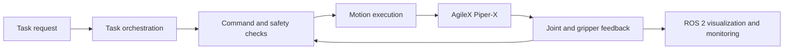

# Auto-Perfect

Auto-Perfect is a professional project case study describing my contribution to an autonomous manipulation workflow built around the AgileX Piper-X robotic arm.

My work focused on connecting robot hardware with a ROS 2 software workflow: communication and feedback, guarded motion execution, visualization, and structured task sequencing. The broader development also explored agent-assisted execution of basic manipulation tasks with less direct operator intervention.

This repository intentionally contains no employer source code, internal datasets, experiment logs, prompts, model files, or private recordings. It documents my engineering responsibilities and the public technologies involved without reproducing the employer's implementation.

## My contribution

- Worked with the AgileX Piper-X six-axis robotic arm and gripper.
- Integrated joint and gripper commands through CAN-based robot communication.
- Used ROS 2 interfaces to connect robot feedback, commands, visualization, and task status.
- Supported live robot-state visualization using RViz and Rerun-based development views.
- Worked on guarded execution concepts including command validation, conservative motion settings, stop handling, and feedback checks.
- Developed and evaluated structured task flows for basic arm motion and manipulation.
- Explored an agent-assisted autonomy layer inspired by published robotics research.
- Supported hardware/software integration, testing, debugging, and validation.

## System context

This diagram is a high-level description of the engineering areas in which I worked. It is not a reconstruction of the employer's internal architecture.

## Technology

| Area | Technology |
| --- | --- |
| Robot platform | AgileX Piper-X |
| Middleware | ROS 2 |
| Robot interface | CAN and the public `piper_sdk` |
| Development | Python |
| Visualization | RViz and Rerun |
| Robotics functions | Joint feedback, gripper control, kinematics, trajectory execution, task sequencing |
| Experimental direction | Agent-assisted autonomous manipulation |

## Scope and status

The project involved real robotic hardware and experimental software development. This public case study does not publish performance figures or claim a complete reproduction of any research system. Agent-assisted autonomy remained an experimental development direction rather than a field-ready autonomous product.

More detail is available in:

- [Contribution summary](docs/contribution-summary.md)
- [Technical overview](docs/technical-overview.md)
- [Evidence and confidentiality](docs/evidence-and-confidentiality.md)
- [Public references](docs/references.md)

## Attribution

Piper-X and its public SDK are products of AgileX Robotics. ENPIRE is referenced only as research inspiration; this repository is not the official ENPIRE implementation and does not claim affiliation with its authors.

## Contact

**Dhinesh Kannan** 
Hardware-focused robotics engineer 
[LinkedIn](https://www.linkedin.com/in/dhinesh-k26/) · [Email](mailto:kannandhinesh26@gmail.com)

## Publication note

No open-source licence is granted for this case-study repository. Third-party names and trademarks remain the property of their respective owners.
